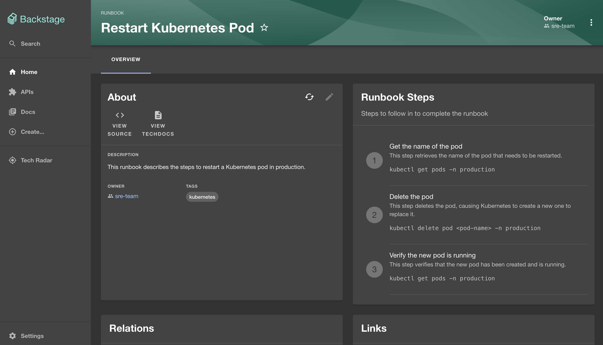
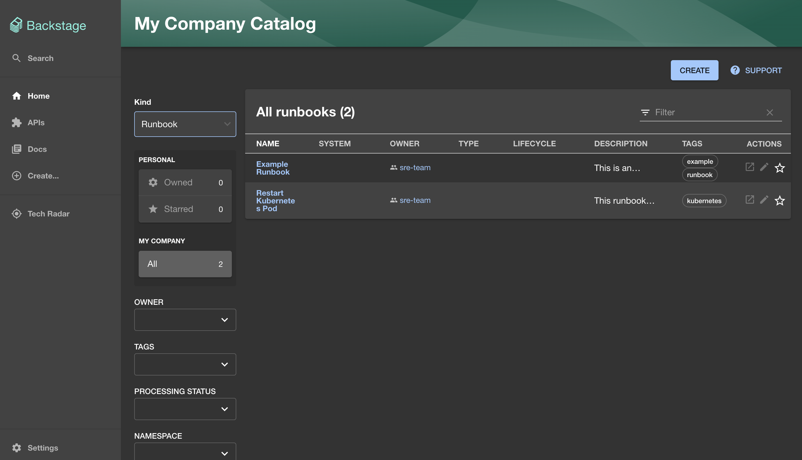
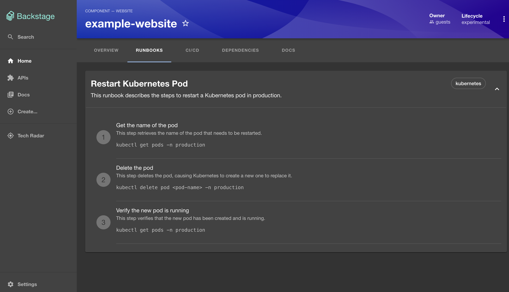

# Backstage Runbooks

The Backstage Software Catalog plugin allows you to create runbooks as standalone entities or bind them to existing services, providing a centralised place for storing operational procedures for your applications.

## Getting Started

### Features

The Runbooks plugin provides the following features:

- Create and manage runbooks as standalone entities
- Bind runbooks to services in the Software Catalog


### Create and manage runbooks

Runbooks can be created as standalone entities as YAML files. They must have an owner and a list of steps to be executed. Each step must have a description and can have a name and a command to be executed.

```yaml
apiVersion: backstage.io/v1alpha1
kind: Runbook
metadata:
  name: restart-kubernetes-pod
  title: Restart Kubernetes Pod
  description: This runbook describes the steps to restart a Kubernetes pod in production.
  tags:
    - kubernetes
spec:
  owner: sre-team
  steps:
    - name: Get the name of the pod
      description: This step retrieves the name of the pod that needs to be restarted.
      command: kubectl get pods -n production
    - name: Delete the pod
      description: This step deletes the pod, causing Kubernetes to create a new one to replace it.
      command: kubectl delete pod <pod-name> -n production
    - name: Verify the new pod is running
      description: This step verifies that the new pod has been created and is running.
      command: kubectl get pods -n production
```






### Bind runbooks to services

Runbooks can be bound to existing services in the Software Catalog. This allows you to associate runbooks with the services they are relevant to, making it easier to find the right runbook when you need it.



You can bind a runbook to a service by adding the `usesRunbooks` field to the `spec` of an existing Component or Resource YAML file. This field should contain a list of runbook names that the service uses.

```yaml
apiVersion: backstage.io/v1alpha1
kind: Component
metadata:
  name: example-backend-service
spec:
  type: service
  lifecycle: experimental
  owner: guests
  system: examples
  providesApis: [example-grpc-api]
  usesRunbooks: # Add this field to bind runbooks to the service
  - restart-kubernetes-pod
```

### Installation
This plugin is composed of two parts: the frontend and the backend. The frontend is the part of the plugin that is displayed in the Backstage UI, while the backend is the part that handles processing and storing the Runbooks to the Backstage Catalogue.

#### Backend
To install the backend add the following to your Backstage `packages/backend`:

```sh
yarn add --cwd packages/backend @antoinedao/backstage-plugin-catalog-backend-module-runbook
```

Then use either of the two options listed below depending on how you have configured your Backend package:

```diff
// packages/backend/src/index.ts
...

// catalog plugin
backend.add(import('@backstage/plugin-catalog-backend/alpha'));
backend.add(
  import('@backstage/plugin-catalog-backend-module-scaffolder-entity-model'),
);
+ backend.add(
+   import('@antoinedao/backstage-plugin-catalog-backend-module-runbook'),
+ );

...
```


Or

```diff
// packages/backend/src/???
```

You should then set your catalogue import config to include `Runbook` entities:

```yaml
catalog:
  import:
    entityFilename: catalog-info.yaml
    pullRequestBranchName: backstage-integration
  rules:
    - allow: [Component, System, API, Resource, Location, Runbook]
  locations:
    # Local example data, file locations are relative to the backend process, typically `packages/backend`
    - type: file
      target: ../../examples/entities.yaml
```

#### Frontend
To install the plugin add the following to your Backstage `packages/app`:

```sh
yarn add --cwd packages/app @antoinedao/backstage-plugin-runbook
```

Then add the plugin to your Backstage instance:

```diff
// packages/app/src/components/catalog/EntityPage.ts

...

+ import { EntityRunbooks, RunbookStepsCard } from '@antoinedao/backstage-plugin-runbook';


const serviceEntityPage = (
  <EntityLayout>
    <EntityLayout.Route path="/" title="Overview">
      {overviewContent}
    </EntityLayout.Route>

+    <EntityLayout.Route path="/runbooks" title="Runbooks">
+      <EntityRunbooks />
+    </EntityLayout.Route>

    <EntityLayout.Route path="/ci-cd" title="CI/CD">
      {cicdContent}
    </EntityLayout.Route>

    <EntityLayout.Route path="/api" title="API">
      <Grid container spacing={3} alignItems="stretch">
        <Grid item md={6}>
          <EntityProvidedApisCard />
        </Grid>
        <Grid item md={6}>
          <EntityConsumedApisCard />
        </Grid>
      </Grid>
    </EntityLayout.Route>

    <EntityLayout.Route path="/dependencies" title="Dependencies">
      <Grid container spacing={3} alignItems="stretch">
        <Grid item md={6}>
          <EntityDependsOnComponentsCard variant="gridItem" />
        </Grid>
        <Grid item md={6}>
          <EntityDependsOnResourcesCard variant="gridItem" />
        </Grid>
      </Grid>
    </EntityLayout.Route>

    <EntityLayout.Route path="/docs" title="Docs">
      {techdocsContent}
    </EntityLayout.Route>
  </EntityLayout>
);

const websiteEntityPage = (
  <EntityLayout>
    <EntityLayout.Route path="/" title="Overview">
      {overviewContent}
    </EntityLayout.Route>

+    <EntityLayout.Route path="/runbooks" title="Runbooks">
+      <EntityRunbooks />
+    </EntityLayout.Route>

    <EntityLayout.Route path="/ci-cd" title="CI/CD">
      {cicdContent}
    </EntityLayout.Route>

    <EntityLayout.Route path="/dependencies" title="Dependencies">
      <Grid container spacing={3} alignItems="stretch">
        <Grid item md={6}>
          <EntityDependsOnComponentsCard variant="gridItem" />
        </Grid>
        <Grid item md={6}>
          <EntityDependsOnResourcesCard variant="gridItem" />
        </Grid>
      </Grid>
    </EntityLayout.Route>

    <EntityLayout.Route path="/docs" title="Docs">
      {techdocsContent}
    </EntityLayout.Route>
  </EntityLayout>
);

# This is the Entity Page for the Runbook object.
# It is not required by will look a bit nicer than the `defaultEntityPage` if you add it.
+ const runbookPage = (
+   <EntityLayout>
+     <EntityLayout.Route path="/" title="Overview">
+       <Grid container spacing={3} alignItems="stretch">
+         {entityWarningContent}
+         <Grid item md={6}>
+           <EntityAboutCard variant="gridItem" />
+         </Grid>
+         <Grid item md={6} xs={12}>
+           <RunbookStepsCard />
+         </Grid>
+         <Grid item md={6} xs={12}>
+           <EntityCatalogGraphCard variant="gridItem" height={400} />
+         </Grid>
+ 
+         <Grid item md={6} xs={12}>
+           <EntityLinksCard />
+         </Grid>
+ 
+       </Grid>
+     </EntityLayout.Route>
+   </EntityLayout>
+ );


export const entityPage = (
  <EntitySwitch>
    <EntitySwitch.Case if={isKind('component')} children={componentPage} />
    <EntitySwitch.Case if={isKind('api')} children={apiPage} />
    <EntitySwitch.Case if={isKind('group')} children={groupPage} />
    <EntitySwitch.Case if={isKind('user')} children={userPage} />
    <EntitySwitch.Case if={isKind('system')} children={systemPage} />
    <EntitySwitch.Case if={isKind('domain')} children={domainPage} />
+    <EntitySwitch.Case if={isKind('runbook')} children={runbookPage} />

    <EntitySwitch.Case>{defaultEntityPage}</EntitySwitch.Case>
  </EntitySwitch>
);


```


## Local Development
This is your newly scaffolded Backstage App, Good Luck!

To start the app, run:

```sh
yarn install
yarn dev
```

To build the app, run:

```sh
yarn build
```

To test the app, run:

```sh
yarn test
```